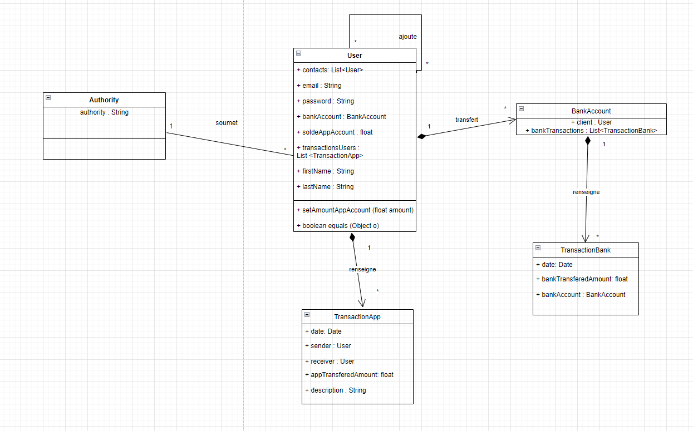
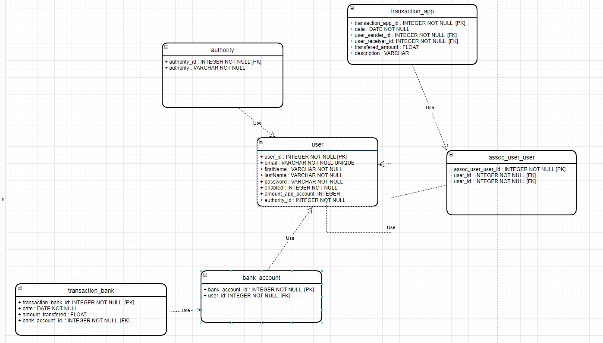

Bonjour,

Bienvenue sur la page descriptive de l'application PayMyBuddy.

Pour des raisons de sécurité, les propriétés spring d'accès à la base de donnée ont été externalisées du projet ,merci
de demander le fichier spring_config.properties au créateur du projet.

Voici ci dessous les documents qui ont permis la conception de l'architecture de la solution :

Diagramme de classe UML :

Modèle physique de données :

